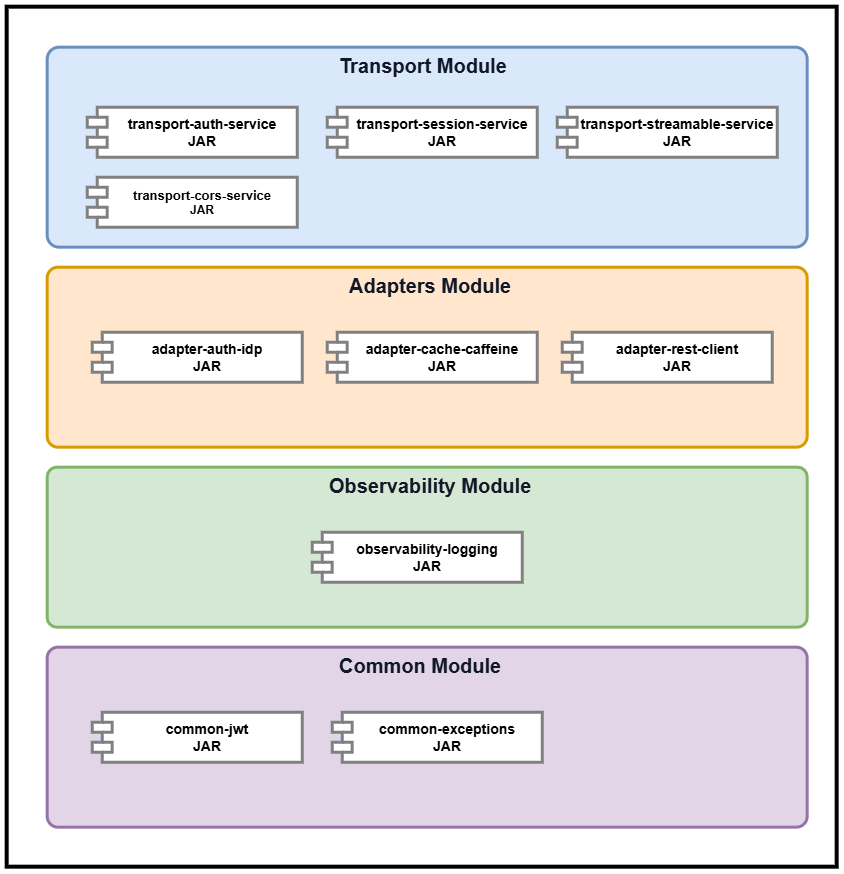

<h1>

</h1>

> **Reference architecture & Maven Archetype for building MCP servers** · Java 25 · Spring Boot 4
---


---
## Introducción

⚓ **Keel** es la *quilla* sobre la que construyes tu servidor MCP (Model Context Protocol): una **arquitectura de referencia modular, estandarizada y organizada por capas**, diseñada para proporcionar una base técnica común para desarrollar servidores MCP sobre **Spring AI**.

> [!IMPORTANT]
> **Keel no es un wrapper de Spring AI ni un simple generador de proyectos.**
>
> **Spring AI** proporciona las capacidades y abstracciones necesarias para implementar MCP, mientras que **Keel** define una **arquitectura, un conjunto de módulos reutilizables y unas convenciones técnicas** para construir servidores MCP de forma estandarizada.

Keel encapsula capacidades técnicas transversales en **módulos independientes y componibles**, evitando que cada proyecto tenga que implementar y configurar las mismas soluciones de infraestructura.

El **Maven Archetype** forma parte de Keel como mecanismo de *scaffolding*, permitiendo generar nuevos MCP Servers que parten de esta arquitectura y de sus capacidades técnicas. De esta forma, el desarrollo puede centrarse en las capacidades funcionales del servidor: **Tools, Resources y Prompts**.

### 🧩 Capacidades proporcionadas

Entre las capacidades proporcionadas por Keel se incluyen:

- **Autenticación y seguridad** — validación de JWT contra un proveedor de identidad OIDC
- **Gestión de sesión MCP** — ciclo de vida del `Mcp-Session-Id`
- **Transporte Streamable HTTP** — endpoint de comunicación con los hosts MCP
- **Configuración de CORS** — para clientes basados en navegador
- **Caché local** — basada en Caffeine
- **Integración con servicios HTTP** — cliente REST preconfigurado para las Tools
- **Observabilidad** — logs estructurados

🚀 **Get started:** utiliza **"Use this template"** en GitHub o clona el repositorio para crear tu propio **MCP Server basado en Keel**.

---
## Índice

- [ Arquitectura de Keel](#arquitectura-de-keel)
    - [🌱 Spring AI MCP Ecosystem](#spring-ai-mcp-ecosystem)
    - [📋 Requisitos previos](#requisitos-previos)
    - [🧰 Stack tecnológico](#stack-tecnológico)
- [🧩 Módulos Java de Keel](#módulos-java-de-keel)
- [🚀 Developer Quickstart & Scaffolding](#developer-quickstart--scaffolding)
    - [🏗️ Generate Scaffolding](#generate-scaffolding)
    - [🔨 Build the Framework](#build-the-framework)
    - [▶️ Ejecutar el servidor](#ejecutar-el-servidor)
- [⚙️ Configuración](#configuración)
- [📁 Estructura del Scaffolding](#estructura-del-scaffolding)
- [🤝 Contribuir](#contribuir)
- [📄 Licencia](#licencia)

---
##  Arquitectura de Keel

La arquitectura de **Keel** define la estructura técnica sobre la que se construyen los MCP Servers generados a partir del arquetipo. Está organizada por capas y componentes, separando las capacidades funcionales de las capacidades técnicas transversales proporcionadas por Keel.

### 🏗️ Keel Architecture Ecosystem


### 🌱 Spring AI MCP Ecosystem

El **MCP Server generado a partir de Keel** se construye sobre el stack tecnológico **Java / Spring Boot**, utilizando **Spring AI** como base para la implementación de MCP.


### 🔧 Requisitos del Framework

| 🏷️ **Categoría** | 🔧 **Requisito**      | 📌 **Versión / Detalle** |
|---|-----------------------|--------------------------|
| ☕ **JDK** | Java Development Kit  | **JDK 25**               |
| 🌱 **Framework** | Spring Boot           | **4.0.6**                |
| 🔌 **MCP** | Spring AI MCP Server `spring-ai-mcp-server-webmvc` | **2.0.0-M6**             |
| 📦 **Build** | Maven                 | **Maven 3.9+**           |

### 🧱 Stack tecnológico

La arquitectura se apoya en **JDK 25** como runtime base y en **Spring Boot 4.x / Spring Framework 7**, aprovechando el starter oficial `spring-ai-mcp-server`, que permite declarar capacidades MCP de forma nativa mediante anotaciones (`@Tool`, `@Resource`, `@Prompt`), sin necesidad de implementar el protocolo JSON-RPC a bajo nivel.

| **Capa** | **Tecnología / Componente**                      | **Responsabilidad** |
|---|--------------------------------------------------|---|
| ☕ **Runtime** | **JDK 25** · Virtual Threads                     | Runtime y modelo de concurrencia para operaciones ligeras y sesiones **Streamable HTTP**. |
| 🌱 **Framework** | **Spring Framework 7.x** · Spring Boot **4.0.6** | IoC/DI, autoconfiguración, configuración y ciclo de vida de la aplicación. |
| 🤖 **AI / MCP** | **Spring AI 2.0.0-M6**                           | Integración MCP y abstracciones para definir y registrar **Tools, Prompts y Resources**. |
| 🔌 **Protocol** | **Model Context Protocol (MCP)**                 | Estándar de interacción entre el cliente MCP y el servidor MCP. |
| 🌐 **Transport** | **Streamable HTTP**                              | Canal de comunicación HTTP entre clientes y servidores MCP. |
| 🔐 **Security** | **JWT** · IdP / JWKS                             | Autenticación y validación de identidad de las peticiones. |
| 🔄 **Session** | **Transport Session Management**                 | Gestión del contexto técnico asociado a las sesiones de transporte. |
| ⚡ **Caching** | **Caffeine**                                     | Caché local para reducir accesos repetitivos a sistemas externos. |
| 📊 **Observability** | **JSON Structured Logging**                      | Estandarización de eventos **TECHNICAL**, **FUNCTIONAL** y **SECURITY**. |
| 🏗️ **Scaffolding** | **Maven Archetype**                              | Generación de una estructura de proyecto MCP estandarizada y reutilizable. |
---

## 📦 Módulos Java para Framework MCP

El siguiente diagrama representa los **componentes internos del framework**, organizados en módulos que conforman su arquitectura base. Cada módulo encapsula una responsabilidad técnica específica y puede evolucionar de forma independiente, manteniendo unos contratos y dependencias claramente definidos.




El framework se apoya, además, en **dependencias de terceros**, como **Spring AI, Spring Boot y Caffeine**, cuya gestión de versiones y compatibilidad se centraliza mediante el **Maven/BOM** del proyecto. Esto permite mantener un stack tecnológico coherente y evitar la gestión individual de versiones en los módulos consumidores.
Esta organización modular permite mantener una **clara separación de responsabilidades**, reducir el acoplamiento entre componentes y facilitar la evolución y reutilización de las capacidades proporcionadas por el framework.

Todos los módulos comparten el group id: `io.github.ricardodlm.springai.mcp` y la versión del proyecto.

| **Módulo** | **Artefacto** | **Responsabilidad / Propósito** |
|---|---|---|
| 🏗️ **Parent / BOM** | `mcp-architecture-framework` | Gestión centralizada de **dependencias, versiones, plugins y propiedades comunes** del framework. |
| 🔐 **Common · JWT** | `common-jwt` | Decodificación de **JWT**, verificación de firma y extracción de claims. |
| 🔑 **Adapter · Auth IdP** | `adapter-auth-idp` | Integración con proveedores de identidad mediante **OIDC**, incluyendo **Red Hat SSO / Keycloak**, JWKS e introspección de tokens. |
| ⚡ **Adapter · Cache** | `adapter-cache-caffeine` | Abstracción de caché local basada en **Caffeine**, con configuración de TTL y tamaño máximo. |
| 🌐 **Adapter · REST Client** | `adapter-rest-client` | Cliente HTTP estandarizado y preconfigurado para el consumo de **APIs REST externas** desde las Tools MCP. |
| 🛡️ **Transport · Auth** | `transport-auth-service` | Filtro Servlet responsable de aplicar **autenticación** sobre los endpoints MCP. |
| 🔄 **Transport · Session** | `transport-session-service` | Gestión del contexto de sesión de transporte, incluyendo autenticación y `Mcp-Session-Id`, con mecanismos de **creación, validación y expiración**. |
| 📡 **Transport · Streamable HTTP** | `transport-streamable-service` | Implementación del transporte MCP basado en **Streamable HTTP**, proporcionando el endpoint de comunicación entre clientes y servidores MCP. |
| 🌍 **Transport · CORS** | `transport-cors-service` | Configuración y gestión de **CORS** para clientes MCP basados en navegador. |
| 📊 **Observability** | `observability` | Generación y estandarización de **logs estructurados** para facilitar la monitorización y trazabilidad del servidor MCP. |

---

## 🚀 Developer Quickstart & Scaffolding

Guía rápida para **generar, configurar y comenzar el desarrollo** de un nuevo servidor MCP utilizando el Maven Archetype, partiendo de una estructura modular y estandarizada.

### 🔨 Build Framework

```bash
# Clone
git clone https://github.com/ricardo07dlm/springai-mcp-archetype.git
# Navigate to the framework
cd springai-mcp-archetype/mcp-architecture-framework
# Build:
mvn clean install
```

### 🏗️ Generate Scaffolding

Para generar un nuevo **scaffolding de un MCP Server**, es necesario disponer previamente del siguiente artefacto:

`mcp-archetype-installer-X.X.X.jar`

> [NOTE]
> Este artefacto se genera durante la fase **Build Framework**.
> Este componente encapsula la **arquitectura base del framework** y proporciona los mecanismos necesarios para generar automáticamente la estructura inicial del proyecto (*scaffold*).

```bash
# Navigate to the mcp-archetype-installer
cd springai-mcp-archetype\mcp-architecture-framework\mcp-archetype-installer\target
# Runtime JAR:
java -jar mcp-archetype-installer-1.0.0.jar <nombreMicroMCP> <versionMicro> <dominioProyecto>
Donde:
- nombreMicroMCP: Nombre del proyecto MCP que se generará.
- versionMicro: Versión inicial del proyecto generado.
- dominioProyecto: Dominio o área funcional a la que pertenece el MCP Server.
Ejemplo: java -jar mcp-archetype-installer-1.0.0.jar mcp-poc 1.0.0 test
```
**Resultado:**

La ejecución finaliza correctamente con BUILD SUCCESS y genera el proyecto MCP Server en el directorio especificado.
```bash
mcp-server-archetype-1.0.0.jar (21 kB at 65 kB/s)

[INFO] ----------------------------------------------------------------------------
[INFO] Using following parameters for creating project from Archetype: mcp-server-archetype:1.0.0
[INFO] ----------------------------------------------------------------------------
[INFO] Parameter: groupId, Value: io.github.ricardodlm.springai.mcp.test.mcppoc
[INFO] Parameter: artifactId, Value: mcp-poc
[INFO] Parameter: version, Value: 1.0.0
[INFO] Parameter: package, Value: io.github.ricardodlm.springai.mcp.test.mcppoc
[INFO] Parameter: packageInPathFormat, Value: io/github/ricardodlm/springai/mcp/test/mcppoc
[INFO] Parameter: package, Value: io.github.ricardodlm.springai.mcp.test.mcppoc
[INFO] Parameter: micro, Value: mcppoc
[INFO] Parameter: domain, Value: test
[INFO] Parameter: domainName, Value: test
[INFO] Parameter: groupId, Value: io.github.ricardodlm.springai.mcp.test.mcppoc
[INFO] Parameter: artifactId, Value: mcp-poc
[INFO] Parameter: transport, Value: mvc
[INFO] Parameter: version, Value: 1.0.0
[INFO] Parameter: microName, Value: mcp-poc
[INFO] Parameter: architectureVersion, Value: 1.0.0
[INFO] Project created from Archetype in dir: C:\temp\prueba-installer\mcp-poc
[INFO] ------------------------------------------------------------------------
[INFO] BUILD SUCCESS
[INFO] ------------------------------------------------------------------------
[INFO] Total time:  1.580 s
[INFO] Finished at: 2026-09-03T20:30:44+02:00
[INFO] ------------------------------------------------------------------------
```

### ▶️ Ejecutar el MCP Server

```bash
# Navigate to the project root directory
cd <directory-root-install-project-mcp>

# Build the project
mvn clean install
# Navigate to the Spring Boot module
cd <project-boot>
# Run the application
mvn spring-boot:run
```

**Ejemplo práctico:**
```bash
# Navigate to the project root directory
cd  C:\temp\prueba-installer\mcp-poc
# Build the project
mvn clean install
[INFO] --- maven-install-plugin:3.1.4:install (default-install) @ mcp-poc-boot ---
[INFO] Installing C:\temp\prueba-installer\mcp-poc\mcp-poc-boot\.flattened-pom.xml to C:\Users\RLibera\.m2\repository\io\github\ricardodlm\springai\mcp\test\mcppoc\mcp-poc-boot\1.0.0\mcp-poc-boot-1.0.0.pom
[INFO] Installing C:\temp\prueba-installer\mcp-poc\mcp-poc-boot\target\mcp-poc-boot-1.0.0.war to C:\Users\RLibera\.m2\repository\io\github\ricardodlm\springai\mcp\test\mcppoc\mcp-poc-boot\1.0.0\mcp-poc-boot-1.0.0.war
[INFO] ------------------------------------------------------------------------
[INFO] Reactor Summary for mcp-poc 1.0.0:
[INFO]
[INFO] mcp-poc ............................................ SUCCESS [  0.519 s]
[INFO] mcp-poc-model ...................................... SUCCESS [  3.732 s]
[INFO] mcp-poc-mcp ........................................ SUCCESS [  3.926 s]
[INFO] mcp-poc-boot ....................................... SUCCESS [ 11.517 s]
[INFO] ------------------------------------------------------------------------
[INFO] BUILD SUCCESS
[INFO] ------------------------------------------------------------------------
[INFO] Total time:  20.118 s
[INFO] Finished at: 2026-09-04T11:17:09+02:00
[INFO] ------------------------------------------------------------------------
# Navigate to the Spring Boot module
cd  C:\temp\prueba-installer\mcp-poc\mcp-poc-boot
# Run the application
mvn spring-boot:run
[INFO] Attaching agents: []

  .   ____          _            __ _ _
 /\\ / ___'_ __ _ _(_)_ __  __ _ \ \ \ \
( ( )\___ | '_ | '_| | '_ \/ _` | \ \ \ \
 \\/  ___)| |_)| | | | | || (_| |  ) ) ) )
  '  |____| .__|_| |_|_| |_\__, | / / / /
 =========|_|==============|___/=/_/_/_/

 :: Spring Boot ::                (v4.0.6)
2026-09-04 11:20:43.976 INFO  [main] org.apache.coyote.http11.Http11NioProtocol - Starting ProtocolHandler ["http-nio-8080"]
2026-09-04 11:20:44.053 INFO  [main] org.springframework.boot.tomcat.TomcatWebServer - Tomcat started on port 8080 (http) with context path '/'
2026-09-04 11:20:44.201 INFO  [main] io.github.ricardodlm.springai.mcp.test.mcppoc.Application - Started Application in 4.384 seconds (process running for 5.383)

```

El endpoint del servidor MCP queda disponible en `http://localhost:8080/mcp`

### 🔌 Conectar un MCP Host

Ejemplo de configuración para un **MCP Host** que se comunica con el servidor mediante **HTTP / Streamable**:

| **Method** | **Endpoint** |
|---|---|
| `POST` | `http://localhost:8080/mcp` |

**Headers:**

| **Header** | **Value** |
|---|---|
| `Content-Type` | `application/json` |
| `Accept` | `text/event-stream, application/json` |
| `Authorization` | `Bearer <jwt>` |

**Request Body:**

```json
{
  "jsonrpc": "2.0",
  "method": "initialize",
  "id": 1,
  "params": {
    "protocolVersion": "2025-03-26",
    "capabilities": {},
    "clientInfo": {
      "name": "test",
      "version": "1.0"
    }
  }
}
```
### 🔌 Métodos nativos del servidor MCP Host

La arquitectura 


---

## Usar los módulos en tu proyecto

Importa el BOM una vez y añade solo los módulos que necesites:

```xml
<dependencyManagement>
  <dependencies>
    <dependency>
      <groupId>io.github.ricardodlm.springai.mcp</groupId>
      <artifactId>mcp-architecture-framework</artifactId>
      <version>1.0.0</version>
      <type>pom</type>
      <scope>import</scope>
    </dependency>
  </dependencies>
</dependencyManagement>

<dependencies>
  <dependency>
    <groupId>io.github.ricardodlm.springai.mcp</groupId>
    <artifactId>transport-auth-service</artifactId>
  </dependency>
  <dependency>
    <groupId>io.github.ricardodlm.springai.mcp</groupId>
    <artifactId>adapter-cache-caffeine</artifactId>
  </dependency>
</dependencies>
```

> Los módulos todavía no están publicados en Maven Central. Ejecuta `mvn install` desde `mcp-architecture-framework` para tenerlos disponibles en tu repositorio local.

Expón una tool desde cualquier bean de Spring:

```java
@Component
public class WeatherTools {

    @Tool(description = "Devuelve la temperatura actual de una ciudad")
    public String currentTemperature(String city) {
        return "Hacen 24 °C en " + city;
    }
}
```

---

## Configuración

Todos los módulos se configuran bajo el prefijo `mcp.*`. <!-- TODO: alinear con los nombres reales de las propiedades -->

```yaml
mcp:
  auth:
    enabled: true
    issuer-uri: https://sso.example.com/realms/mcp
    jwk-set-uri: https://sso.example.com/realms/mcp/protocol/openid-connect/certs
    required-scope: mcp:tools
  cors:
    allowed-origins:
      - https://mi-host-mcp.example.com
    allowed-methods: [GET, POST, OPTIONS]
  cache:
    caffeine:
      ttl: 5m
      maximum-size: 10000
  rest-client:
    connect-timeout: 2s
    read-timeout: 10s
```

---

## Estructura del Maven Archetype

```
springai-mcp-archetype/
└── mcp-architecture-framework/          # POM padre / BOM
    ├── common-architecture-fwk/
    │   └── common-jwt/
    │   ├── common-exceptions/
    ├── adapters-architecture-fwk/
    │   ├── adapter-auth-idp/
    │   ├── adapter-cache-caffeine/
    │   └── adapter-rest-client/
    ├── transport-architecture-fwk/
    │   ├── transport-auth-service/
    │   ├── transport-cors-service/
    │   ├── transport-session-service/
    │   └── transport-streamable-service/
    └── observability-architecture-fwk/
        └── observability-logging/
```

## Módulo de Generación de Scaffolding

```
springai-mcp-archetype/
└── mcp-architecture-framework/  
    ├── mcp-archetype-installer/  # Archetype Installer / Dependeicas
    ├── mcp-server-archetype/     # Archetype Maven para generar proyectos MCP Server  
```

Convención de packages: `io.github.ricardodlm.springai.mcp.<capa>.<módulo>` — p. ej. `io.github.ricardodlm.springai.mcp.adapters.auth.idp`.

---

## Build y desarrollo

| Comando | Qué hace |
|---|---|
| `mvn clean install` | Build completo con tests (ejecutar desde `mcp-architecture-framework`) |
| `mvn -N install` | Instala solo el POM padre / BOM |
| `mvn install -pl adapters-architecture-fwk/adapter-auth-idp -am` | Compila un módulo y sus dependencias |
| `mvn verify -s /dev/null` | Verifica que el build resuelve todo desde Maven Central sin settings personalizados |


## Contribuir

Los issues y pull requests son bienvenidos. Para cambios grandes, abre primero un issue para que podamos discutir el diseño.

---

## Licencia

Distribuido bajo la [Apache License 2.0](LICENSE). <!-- TODO: añadir archivo LICENSE -->

---

Creado por **Ricardo D. L. M.** · [LinkedIn](https://www.linkedin.com/in/<!-- TODO -->) · [GitHub](https://github.com/ricardo07dlm)
